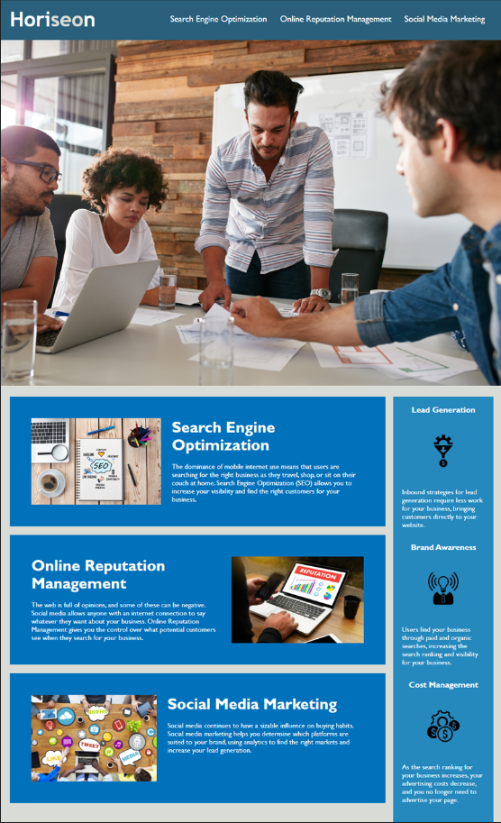

# code-refactor
This is a code refactor, Challenge #01.

## Description

A webpage with several sections of information. The links at the top act as a table of contents, guiding you to specific sections with more detailed information. This is the first challenge of the DU bootcamp. The point of this project was to reorganized the information refactoring existing code to meet accessibility standards, emphasizing the importance of semantic HTML elements and global selectors in CSS.

## Table of Contents

- [Credits](#credits)
- [License](#license)
- [Appearance](#websiteappearance)

## Credits

N/A

## License

Please refer to the LICENSE in the repo.

## Website Appearance

The following image shows the web application's appearance and functionality:

---

## Badges

## Thanks for stopping here!.
